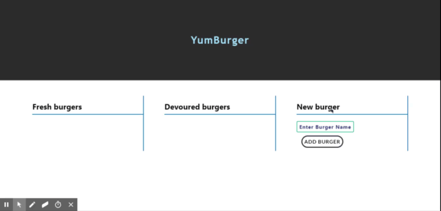

# YumBurger

YumBurger is an MVC app built with Node.js, express, handlebars, validator, and in production uses JawsDB (MySQL) on Heroku, and was built as an exercise in data persistence and maintaining state. This version is built using Sequelize. The user can create burgers and update the state of the burgers from "not devoured" to "devoured." 



## Getting started

To view this app in production simply navigate to https://yumburger-sequel.herokuapp.com/

To develop on your local machine:

1) Git clone, run `npm install` and create a .env file in the root directory of the project
2) In your .env file, define the following SQL credentials:
    DB_HOST=localhost
    DB_USER=root
    DB_PASS=""
    DB_NAME=burgers_db
3) In MySQL workbench or using the mysql CLI, run `db/schema.sql` to build your database and table. Run `db/seeds.sql` to get started with some seed data
4) Define your port (default is 8080) in `server.js`
5) Make sure your SQL server is running and then run `node server.js`. Open `http://localhost:8080/` (or wherever you define your port or host) in your favorite browser

### Prerequisites

For local development: 
```
    Node
    NPM
    MySQL 
```
